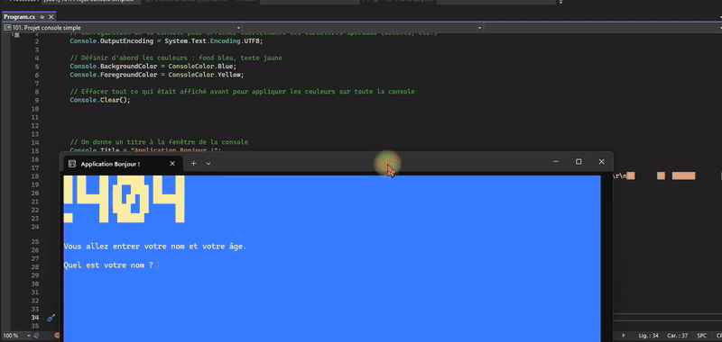

<h1 align="center">👋 Projet Console - Application Bonjour</h1>

<p align="center">
  <strong>Application console interactive avec validation des entrées utilisateur</strong>
</p>

<p align="center">
  
  
  
  
</p>

---

## 📖 Description

Ce projet est une **application console interactive** développée en C# qui illustre les concepts fondamentaux de la programmation : saisie utilisateur, validation des données, fonctions et affichage formaté.

L'application demande à l'utilisateur son **nom** et son **âge**, valide les entrées, puis affiche un message de bienvenue personnalisé avec une interface console colorée.

### 🎯 Objectifs pédagogiques

Ce projet permet d'apprendre et de pratiquer :

- ✅ **Entrées/Sorties console** : `Console.ReadLine()`, `Console.WriteLine()`
- ✅ **Validation de données** : Vérification des saisies utilisateur
- ✅ **Fonctions et délégués** : Utilisation de `Func<T, bool>` pour la validation
- ✅ **LINQ** : Méthodes `All()` et `Count()` sur les chaînes
- ✅ **Interpolation de chaînes** : Syntaxe `$"Bonjour {nom}"`
- ✅ **Personnalisation console** : Couleurs, titre de fenêtre

---

## 📸 Aperçu de l'application



---

## 🌟 Fonctionnalités

### 🎨 Interface utilisateur

- **Couleurs personnalisées** : Fond bleu avec texte jaune
- **Titre de fenêtre** : "Application Bonjour !"
- **ASCII Art** : Logo stylisé "1H04" au démarrage
- **Support UTF-8** : Gestion correcte des accents français

### ✅ Validation du nom

| Règle                | Description                    |
| -------------------- | ------------------------------ |
| Longueur minimale    | Au moins 3 lettres             |
| Caractères autorisés | Lettres et espaces uniquement  |
| Pas de chiffres      | Les nombres sont refusés       |
| Pas vide             | Les espaces seuls sont refusés |

### ✅ Validation de l'âge

| Règle        | Description               |
| ------------ | ------------------------- |
| Format       | Nombre entier uniquement  |
| Valeur       | Doit être positif (≥ 0)   |
| Pas de texte | Les lettres sont refusées |

### 🔄 Gestion des erreurs

- **Messages d'erreur clairs** : Indique précisément le problème
- **Boucle de ressaisie** : Redemande jusqu'à obtenir une valeur valide
- **Robustesse** : Ne plante jamais, même avec des entrées incorrectes

---

## 🛠️ Concepts C# utilisés

### Fonction générique de validation

```csharp
string DemanderSaisie(string message, string messageErreur, Func<string, bool> verifier)
```

Cette fonction réutilisable permet de :

- Afficher un message de demande
- Lire la saisie utilisateur
- Valider avec une fonction passée en paramètre
- Redemander en cas d'erreur

### Validation avec LINQ

```csharp
bool tousCaracteresValides = nom.All(c => char.IsLetter(c) || char.IsWhiteSpace(c));
int nombreDeLettres = nom.Count(char.IsLetter);
```

### Conversion sécurisée

```csharp
int.TryParse(saisie, out int age)
```

---

## 💻 Code source complet

```csharp
// Configuration de la console pour afficher correctement les caractères spéciaux (accents, etc.)
Console.OutputEncoding = System.Text.Encoding.UTF8;

// Définir d'abord les couleurs : fond bleu, texte jaune
Console.BackgroundColor = ConsoleColor.Blue;
Console.ForegroundColor = ConsoleColor.Yellow;

// Effacer tout ce qui était affiché avant pour appliquer les couleurs sur toute la console
Console.Clear();

// On donne un titre à la fenêtre de la console
Console.Title = "Application Bonjour !";

// On affiche un petit message d'accueil pour l'utilisateur
Console.WriteLine("██ ██   ██  ██████  ██   ██ \r\n██ ██   ██ ██  ████ ██   ██ \r\n██ ███████ ██ ██ ██ ███████ \r\n        ██ ████  ██      ██ \r\n██      ██  ██████       ██ \r\n                            \r\n                            ");
Console.WriteLine("Vous allez entrer votre nom et votre âge.");
Console.WriteLine(); // Ligne vide pour l'aération

//------------------------------------------------------------
// FONCTION GÉNÉRIQUE POUR DEMANDER UNE SAISIE AVEC VALIDATION
//------------------------------------------------------------
string DemanderSaisie(string message, string messageErreur, Func<string, bool> verifier)
{
   Console.Write(message); // Affiche le message pour l'utilisateur
   string saisie = Console.ReadLine(); // Lit ce que l'utilisateur a tapé

   // Tant que la saisie est invalide, on affiche un message d'erreur et on redemande
   while (!verifier(saisie))
   {
       Console.Write(messageErreur);
       saisie = Console.ReadLine();
   }

   return saisie; // Retourne la saisie valide
}

//------------------------------------------------------------
// FONCTION DE VALIDATION DU NOM
//------------------------------------------------------------
bool NomEstValide(string nom)
{
   // Vérifie que la saisie n'est pas vide ou composée uniquement d'espaces
   if (string.IsNullOrWhiteSpace(nom)) return false;

   // On vérifie que tous les caractères sont des lettres ou des espaces
   bool tousCaracteresValides = nom.All(c => char.IsLetter(c) || char.IsWhiteSpace(c));

   // On compte le nombre de lettres (en ignorant les espaces)
   int nombreDeLettres = nom.Count(char.IsLetter);

   // Le nom est valide si tous les caractères sont corrects et qu'il y a au moins 3 lettres
   return tousCaracteresValides && nombreDeLettres >= 3;
}

//------------------------------------------------------------
// FONCTION DE VALIDATION DE L'ÂGE
//------------------------------------------------------------
bool AgeEstValide(string saisie)
{
   // On vérifie que la saisie est un entier >= 0
   return !string.IsNullOrWhiteSpace(saisie)
          && int.TryParse(saisie, out int age)
          && age >= 0;
}

//------------------------------------------------------------
// DEMANDE DU NOM DE L'UTILISATEUR
//------------------------------------------------------------
string nomUtilisateur = DemanderSaisie(
   message: "Quel est votre nom ? ",
   messageErreur: "Nom invalide. Entrez au moins 3 lettres, sans chiffres ni caractères spéciaux : ",
   verifier: NomEstValide
);

//------------------------------------------------------------
// DEMANDE DE L'ÂGE DE L'UTILISATEUR
//------------------------------------------------------------
string saisieAge = DemanderSaisie(
   message: "Quel est votre âge ? ",
   messageErreur: "Âge invalide. Entrez un nombre entier positif : ",
   verifier: AgeEstValide
);

//------------------------------------------------------------
// CONVERSION DE L'ÂGE ET AFFICHAGE DES RÉSULTATS
//------------------------------------------------------------
int ageUtilisateur = int.Parse(saisieAge); // Conversion de la chaîne en entier

// Affichage final avec le nom et l'âge
Console.WriteLine(); // Ligne vide
Console.WriteLine($"Bonjour {nomUtilisateur} !");
Console.WriteLine($"Vous avez {ageUtilisateur} ans.");
Console.WriteLine($"L'année prochaine, vous aurez {ageUtilisateur + 1} ans.");
```

---

## 🚀 Exécution

### Prérequis

- [.NET SDK](https://dotnet.microsoft.com/download) installé sur votre machine

### Lancer le projet

```bash
cd "101. Projet console simple"
dotnet run
```

---

## 📚 Ce que vous apprendrez

| Concept               | Description                                    |
| --------------------- | ---------------------------------------------- |
| `Console.ReadLine()`  | Lire une entrée utilisateur                    |
| `Console.WriteLine()` | Afficher du texte                              |
| `Func<T, TResult>`    | Délégué générique pour passer des fonctions    |
| `string.All()`        | Vérifier une condition sur tous les caractères |
| `int.TryParse()`      | Conversion sécurisée string → int              |
| `$"..."`              | Interpolation de chaînes                       |
| Boucle `while`        | Répéter jusqu'à condition remplie              |

---

## 💡 Idées d'amélioration

- [ ] Ajouter la validation de l'email
- [ ] Calculer l'année de naissance
- [ ] Sauvegarder les données dans un fichier
- [ ] Ajouter un menu avec plusieurs options
- [ ] Créer une version avec interface graphique (WPF)
