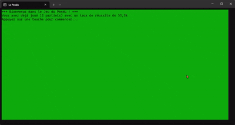

# Projet du pendu

## Description

Ce projet est un jeu de pendu en C# qui permet de jouer contre l'ordinateur.

## Fonctionnalités

- Le joueur doit deviner un mot en proposant des lettres une par une

## Aperçu de l'application



## Code

```csharp
// ==================== JEU DU PENDU - PROGRAMME PRINCIPAL ====================
// Ce programme implémente le jeu classique du pendu en C#
// Le joueur doit deviner un mot en proposant des lettres une par une
// Il a 6 essais avant d'être "pendu" (perdre la partie)

// Importation des bibliothèques nécessaires
using System;        // Pour les fonctionnalités de base (Console, Random, etc.)
using System.Linq;   // Pour les méthodes d'extension LINQ (Contains, etc.)

// ==================== CONFIGURATION DE LA CONSOLE ====================
// Définition du titre de la fenêtre de la console
Console.Title = "Le Pendu";

// Configuration des couleurs de l'interface utilisateur
// Fond vert pour une apparence agréable et reposante pour les yeux
Console.BackgroundColor = ConsoleColor.Green;
// Texte noir pour un bon contraste sur fond vert
Console.ForegroundColor = ConsoleColor.Black;
// Effacement de l'écran pour appliquer les nouvelles couleurs
Console.Clear();

// ==================== BASE DE DONNÉES DES MOTS ====================
// Tableau contenant tous les mots possibles pour le jeu
// Inclut des aliments, métiers, animaux, pays, villes, etc.
// Les mots sont en français pour correspondre au contexte
string[] aliments = new string[]
{
    // Fruits
    "Pomme", "Banane", "Orange", "Raisin", "Fraise", "Cerise", "Mangue", "Ananas", "Melon", "Pastèque",
    // Légumes
    "Tomate", "Carotte", "Poivron", "Concombre", "Courgette", "Aubergine", "Brocoli", "Chou", "Laitue", "Épinards",
    // Légumes racines et féculents
    "Pommes de terre", "Oignon", "Ail", "Radis", "Betterave", "Navet", "Maïs", "Petit pois", "Haricot vert", "Champignon",
    // Céréales et pains
    "Pain", "Baguette", "Croissant", "Brioche", "Pain complet", "Pain de mie", "Céréales", "Riz", "Pâtes", "Semoule",
    // Légumineuses et protéines végétales
    "Lentilles", "Pois chiches", "Quinoa", "Soja", "Tofu", "Tempeh", "Viande", "Bœuf", "Poulet", "Porc",
    // Viandes
    "Agneau", "Canard", "Jambon", "Saucisse", "Lardons", "Poisson", "Saumon", "Thon", "Cabillaud", "Sardine",
    // Fruits de mer
    "Crevette", "Crabe", "Homard", "Moules", "Huîtres", "Fromage", "Yaourt", "Lait", "Beurre", "Crème",
    // Produits laitiers et autres
    "Œuf", "Chocolat", "Sucre", "Miel", "Confiture", "Compote", "Gâteau", "Tarte", "Crêpe", "Biscuits",
    // Desserts et boissons
    "Glace", "Bonbon", "Jus de fruit", "Soda", "Eau", "Café", "Thé", "Vin", "Bière", "Huile",
    // Condiments et épices
    "Vinaigre", "Sel", "Poivre", "Épices", "Herbes", "Basilic", "Persil", "Coriandre", "Menthe", "Romarin",

    // ==================== MÉTIERS ====================
    // Professions libérales et intellectuelles
    "Actuaire", "Agriculteur", "Aide-soignant", "Architecte", "Artisan",
    "Astronaute", "Avocat", "Barman", "Bibliothécaire", "Boulanger",
    // Métiers manuels et techniques
    "Capitaine", "Carreleur", "Charpentier", "Chauffeur", "Chirurgien",
    "Coiffeur", "Comptable", "Conducteur", "Couturier", "Cuisinier",
    // Professions médicales et paramédicales
    "Dentiste", "Designer", "Développeur", "Diététicien", "Directeur",
    "Docteur", "Éboueur", "Électricien", "Enseignant", "Entrepreneur",
    // Métiers de service et commerce
    "Épicier", "Esthéticienne", "Expert", "Facteur", "Ferronnier",
    "Fleuriste", "Forestier", "Géologue", "Graphiste", "Horloger",
    // Professions techniques et scientifiques
    "Infirmier", "Ingénieur", "Instituteur", "Interprète", "Jardinier",
    "Journaliste", "Juge", "Libraire", "Livreur", "Maçon",
    // Métiers de la construction et services
    "Magasinier", "Maître-nageur", "Mannequin", "Marin", "Mécanicien",
    "Menuisier", "Médecin", "Militaire", "Musicien", "Notaire",
    // Professions spécialisées
    "Opticien", "Ouvrier", "Pâtissier", "Peintre", "Pédiatre",
    "Pharmacien", "Photographe", "Pilote", "Plombier", "Policier",
    "Pompier", "Professeur", "Programmeur", "Prothésiste", "Psychologue",
    // Métiers de la santé et services sociaux
    "Puéricultrice", "Rédacteur", "Restaurateur", "Sapeur-pompier", "Secrétaire",
    "Serveur", "Soudeur", "Styliste", "Surveillant", "Tailleur",
    // Professions techniques et commerciales
    "Technicien", "Télévendeur", "Traducteur", "Urbaniste", "Vendeur",
    "Vétérinaire", "Webdesigner", "Zoologiste", "Ébéniste", "Éducateur",
    // Métiers spécialisés
    "Étancheur", "Garagiste", "Géomètre", "Horticulteur", "Imprimeur",
    "Juge d'instruction", "Kinésithérapeute", "Maître d'hôtel", "Mécanicien automobile", "Négociant",

    // ==================== ANIMAUX ====================
    // Mammifères domestiques et sauvages
    "chien", "chat", "lion", "tigre", "éléphant", "girafe", "zèbre", "cheval", "cerf", "sanglier",
    "loup", "renard", "ours", "lapin", "écureuil", "koala", "kangourou", "panda", "gorille", "chimpanzé",
    // Grands mammifères
    "hippopotame", "rhinocéros", "dauphin", "requin", "baleine", "poisson", "pieuvre", "crabe", "homard", "méduses",
    // Oiseaux
    "perroquet", "canari", "hibou", "aigle", "faucon", "colibri", "cygne", "paon", "autruche", "pingouin",
    // Reptiles et amphibiens
    "serpent", "lézard", "crocodile", "caméléon", "gecko", "tortue", "grenouille", "salamandre", "escargot", "araignée",
    // Insectes et invertébrés
    "fourmi", "abeille", "papillon", "mouche", "libellule", "coccinelle", "scarabée", "sauterelle", "ver de terre", "chenille",
    // Petits mammifères
    "hérisson", "taupe", "rat", "souris", "castor", "loutre", "bison", "antilopes", "chameau", "dromadaire",
    // Animaux de ferme
    "chèvre", "mouton", "vache", "taureau", "cochon", "poule", "canard", "oie", "dindon", "cigogne",
    // Mammifères sauvages divers
    "furet", "hamster", "marmotte", "raton laveur", "opossum", "blaireau", "lémurien", "mandrill", "tatou", "puma",
    "jaguar", "panthère", "lynx", "chacal", "guépard", "hibiscus", "ornithorynque", "axolotl", "narval", "okapi",
    "pangolin",

    // ==================== PAYS ====================
    // Europe
    "France", "Allemagne", "Espagne", "Italie", "Portugal", "Belgique", "Pays-Bas", "Suisse", "Autriche", "Royaume-Uni",
    "Irlande", "Suède", "Norvège", "Danemark", "Finlande", "Islande", "Grèce", "Turquie", "Russie", "Ukraine",
    // Amériques
    "États-Unis", "Canada", "Mexique", "Brésil", "Argentine", "Chili", "Colombie", "Pérou", "Venezuela", "Équateur",
    "Paraguay", "Uruguay", "Bolivie", "Costa Rica", "Panama", "Cuba", "Jamaïque", "Haïti", "République Dominicaine", "Guatemala",
    // Asie et Océanie
    "Australie", "Nouvelle-Zélande", "Indonésie", "Malaisie", "Philippines", "Thaïlande", "Vietnam", "Singapour", "Japon", "Corée du Sud",
    "Inde", "Pakistan", "Bangladesh", "Sri Lanka", "Maldives", "Afghanistan", "Kazakhstan", "Ouzbékistan", "Turkménistan", "Iran",
    // Moyen-Orient et Afrique
    "Irak", "Syrie", "Liban", "Israël", "Jordanie", "Arabie Saoudite", "Égypte", "Libye", "Tunisie", "Maroc",
    "Algérie", "Soudan", "Somalie", "Éthiopie", "Kenya", "Ouganda", "Tanzanie", "Madagascar", "Afrique du Sud", "Nigeria",
    "Ghana", "Sénégal", "Mali", "Côte d'Ivoire", "Cameroun", "Angola", "Zambie", "Zimbabwe", "Namibie", "Botswana",
    // Asie centrale et orientale
    "Chine", "Mongolie", "Taïwan", "Hong Kong", "Bhoutan", "Népal", "Arménie", "Azerbaïdjan", "Géorgie", "Chypre",

    // ==================== VILLES ====================
    // Europe
    "Paris", "Londres", "New York", "Tokyo", "Shanghai", "Pékin", "Moscou", "Berlin", "Rome", "Madrid",
    "Lisbonne", "Bruxelles", "Amsterdam", "Oslo", "Stockholm", "Helsinki", "Copenhague", "Dublin", "Athènes", "Vienne",
    "Zurich", "Prague", "Budapest", "Varsovie", "Istanbul", "Le Caire", "Casablanca", "Dakar", "Nairobi", "Johannesburg",
    // Afrique et Moyen-Orient
    "Lagos", "Abidjan", "Tunis", "Alger", "Rabat", "Doha", "Dubaï", "Riyad", "Téhéran", "Bagdad",
    "Kaboul", "Islamabad", "New Delhi", "Bombay", "Calcutta", "Bangalore", "Katmandou", "Bangkok", "Hanoï", "Manille",
    // Asie et Océanie
    "Jakarta", "Singapour", "Séoul", "Hong Kong", "Taipei", "Canberra", "Sydney", "Melbourne", "Auckland", "Wellington",
    // Amériques
    "Ottawa", "Toronto", "Montréal", "Vancouver", "Mexico", "Buenos Aires", "Rio de Janeiro", "São Paulo", "Lima", "Santiago",
    "Bogota", "Caracas", "Quito", "La Paz", "Panama", "San José", "La Havane", "Port-au-Prince", "Saint-Domingue", "Kingston",
    // États-Unis
    "Washington", "Chicago", "Los Angeles", "San Francisco", "Miami", "Houston", "Atlanta", "Boston", "Seattle", "Denver",
    "Phoenix", "Philadelphie", "Détroit", "Minneapolis", "Las Vegas", "Anchorage", "Honolulu", "Reykjavik", "Tallinn", "Vilnius"
};

// ==================== FONCTIONS UTILITAIRES ====================

/// <summary>
/// Normalise un caractère pour la comparaison (ex: ç => c, â/ä => a, etc.)
/// </summary>
char NormalizeChar(char c)
{
    c = char.ToUpperInvariant(c);
    switch (c)
    {
        case 'À': case 'Â': case 'Ä': return 'A';
        case 'Ç': return 'C';
        case 'É': case 'È': case 'Ê': case 'Ë': return 'E';
        case 'Î': case 'Ï': return 'I';
        case 'Ô': case 'Ö': return 'O';
        case 'Ù': case 'Û': case 'Ü': return 'U';
        case 'Ÿ': return 'Y';
        default: return c;
    }
}

/// <summary>
/// Affiche le dessin du pendu selon le nombre d'erreurs commises
/// </summary>
/// <param name="erreurs">Nombre d'erreurs (0 à 6)</param>
void AfficherPendu(int erreurs)
{
    // Tableau contenant les différentes étapes du dessin du pendu
    // Chaque élément représente une étape de plus dans la construction du pendu
    string[] pendu = new string[]
    {
        "\n\n\n\n\n\n\n",                                    // 0 erreur : rien
        "\n\n\n\n\n\n____\n",                               // 1 erreur : base
        " |\n |\n |\n |\n |\n_|___\n",                     // 2 erreurs : potence
        " _______\n |/      |\n |\n |\n |\n_|___\n",        // 3 erreurs : potence complète
        " _______\n |/      |\n |      (_)\n |\n |\n_|___\n", // 4 erreurs : tête
        " _______\n |/      |\n |      (_)\n |      /|\\\n |\n_|___\n", // 5 erreurs : corps
        " _______\n |/      |\n |      (_)\n |      /|\\\n |      / \\\n_|___\n" // 6 erreurs : pendu complet
    };

    // Affiche le dessin correspondant au nombre d'erreurs
    // Math.Min garantit qu'on ne dépasse pas la taille du tableau
    Console.WriteLine(pendu[Math.Min(erreurs, pendu.Length - 1)]);
}

/// <summary>
/// Affiche le mot à deviner avec les lettres trouvées et les underscores pour les lettres manquantes
/// </summary>
/// <param name="mot">Le mot complet à deviner</param>
/// <param name="lettresTrouvees">Tableau booléen indiquant quelles lettres ont été trouvées</param>
void AfficherMot(string mot, bool[] lettresTrouvees)
{
    // Sauvegarder la couleur actuelle pour pouvoir la restaurer après
    ConsoleColor couleurActuelle = Console.ForegroundColor;

    // Changer la couleur en blanc pour mettre le mot en évidence
    Console.ForegroundColor = ConsoleColor.White;

    // Parcourir chaque caractère du mot
    for (int i = 0; i < mot.Length; i++)
    {
        char c = mot[i]; // Caractère actuel

        // Vérifier si c'est une lettre (pas un espace, tiret, etc.)
        if (char.IsLetter(c))
        {
            // Si la lettre a été trouvée, l'afficher
            if (lettresTrouvees[i])
                Console.Write(c + " ");
            else
                // Sinon, afficher un underscore pour indiquer une lettre manquante
                Console.Write("_ ");
        }
        else
        {
            // Pour les caractères non-lettres (espaces, tirets), les afficher tels quels
            Console.Write(c + " ");
        }
    }
    Console.WriteLine(); // Retour à la ligne après le mot

    // Restaurer la couleur jaune pour le reste de l'interface
    Console.ForegroundColor = couleurActuelle;
}

// ==================== FONCTION PRINCIPALE DU JEU ====================

/// <summary>
/// Fonction principale qui gère une partie complète du jeu du pendu
/// </summary>
void JouerPendu()
{
    // Initialisation du générateur de nombres aléatoires
    var rand = new Random();

    // Sélection aléatoire d'un mot dans la base de données
    // ToUpperInvariant() convertit le mot en majuscules pour faciliter la comparaison
    string motADeviner = aliments[rand.Next(aliments.Length)].ToUpperInvariant();

    // Tableau booléen pour suivre quelles lettres ont été trouvées
    // La taille correspond à la longueur du mot
    bool[] lettresTrouvees = new bool[motADeviner.Length];

    // Nombre d'essais restants (le joueur perd après 6 erreurs)
    int essaisRestants = 6;

    // Chaîne pour stocker les lettres déjà essayées par le joueur
    string lettresEssayees = "";

    // Variable pour indiquer si le joueur a gagné
    bool gagne = false;

    // ==================== BOUCLE PRINCIPALE DU JEU ====================
    // Continue tant que le joueur a des essais et n'a pas encore gagné
    while (essaisRestants > 0 && !gagne)
    {
        // Effacer l'écran pour une interface propre
        Console.Clear();

        // Affichage de l'interface de jeu
        Console.WriteLine("==== Jeu du Pendu ====");

        // Afficher le pendu avec le nombre d'erreurs actuelles
        AfficherPendu(6 - essaisRestants);

        // Afficher le nombre d'essais restants
        Console.WriteLine($"Essais restants : {essaisRestants}");

        // Afficher le mot à deviner avec les lettres trouvées
        Console.Write("Mot à deviner : ");
        AfficherMot(motADeviner, lettresTrouvees);

        // Afficher les lettres déjà essayées
        Console.WriteLine($"Lettres essayées : {lettresEssayees}");

        // Demander au joueur de proposer une lettre
        Console.Write("Proposez une lettre : ");
        string saisie = Console.ReadLine().ToUpperInvariant();

        // ==================== VALIDATION DE LA SAISIE ====================
        // Vérifier que la saisie est valide (une seule lettre)
        if (string.IsNullOrWhiteSpace(saisie) || saisie.Length != 1 || !char.IsLetter(saisie[0]))
        {
            Console.WriteLine("Veuillez entrer une seule lettre.");
            Console.ReadKey(); // Attendre que le joueur appuie sur une touche
            continue; // Recommencer la boucle
        }

        char lettre = saisie[0]; // Extraire la lettre saisie

        // Vérifier si la lettre a déjà été essayée
        if (lettresEssayees.Contains(lettre))
        {
            Console.WriteLine("Vous avez déjà essayé cette lettre.");
            Console.ReadKey(); // Attendre que le joueur appuie sur une touche
            continue; // Recommencer la boucle
        }

        // Ajouter la lettre à la liste des lettres essayées
        lettresEssayees += lettre + " ";

        // ==================== VÉRIFICATION DE LA LETTRE ====================
        bool trouve = false; // Variable pour indiquer si la lettre a été trouvée
        char lettreNorm = NormalizeChar(lettre);
        // Parcourir le mot pour chercher la lettre proposée
        for (int i = 0; i < motADeviner.Length; i++)
        {
            if (char.IsLetter(motADeviner[i]) && NormalizeChar(motADeviner[i]) == lettreNorm)
            {
                // Marquer cette position comme trouvée
                lettresTrouvees[i] = true;
                trouve = true; // La lettre a été trouvée au moins une fois
            }
        }

        // Si la lettre n'a pas été trouvée, décrémenter le nombre d'essais
        if (!trouve)
            essaisRestants--;

        // ==================== VÉRIFICATION DE LA VICTOIRE ====================
        // Vérifier si toutes les lettres ont été trouvées
        gagne = true; // On suppose que le joueur a gagné

        // Parcourir le mot pour vérifier si toutes les lettres sont trouvées
        for (int i = 0; i < motADeviner.Length; i++)
        {
            // Si c'est une lettre et qu'elle n'a pas été trouvée
            if (char.IsLetter(motADeviner[i]) && !lettresTrouvees[i])
            {
                gagne = false; // Le joueur n'a pas encore gagné
                break; // Sortir de la boucle
            }
        }
    }

    // ==================== FIN DE PARTIE ====================
    // Effacer l'écran pour afficher le résultat final
    Console.Clear();

    if (gagne)
    {
        // Le joueur a gagné : toutes les lettres ont été trouvées
        Console.WriteLine("Bravo ! Vous avez trouvé le mot : " + motADeviner);
    }
    else
    {
        // Le joueur a perdu : afficher le pendu complet et le mot
        AfficherPendu(6); // Pendu complet
        Console.WriteLine("Dommage ! Le mot était : " + motADeviner);
    }
}

// ==================== BOUCLE PRINCIPALE DU PROGRAMME ====================
// Boucle infinie pour permettre de rejouer plusieurs parties
while (true)
{
    // Lancer une partie du jeu
    JouerPendu();

    // Demander au joueur s'il veut rejouer
    Console.WriteLine("Voulez-vous rejouer ? (O/N)");
    string reponse = Console.ReadLine().Trim().ToUpperInvariant();

    // Si la réponse n'est pas "O" (Oui), sortir de la boucle
    if (reponse != "O")
        break;
}

// ==================== FIN DU PROGRAMME ====================
// Le programme se termine ici quand le joueur ne veut plus rejouer
```
