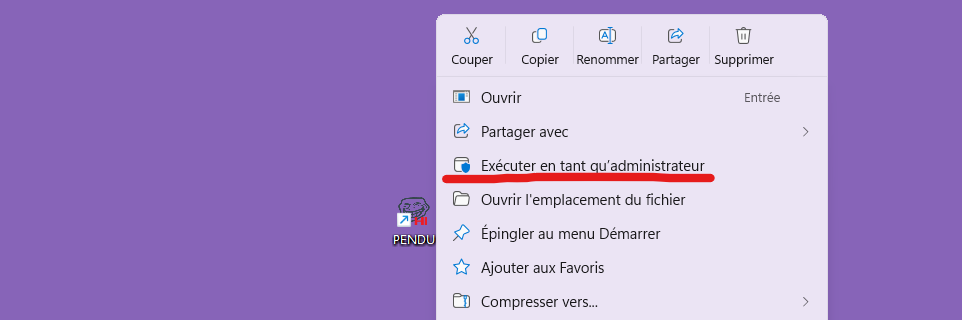
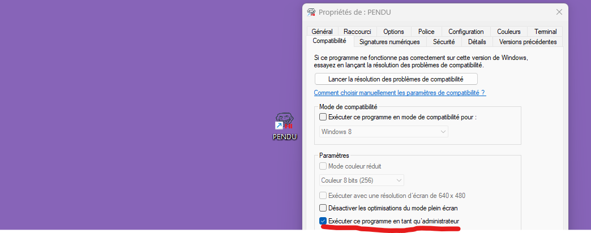
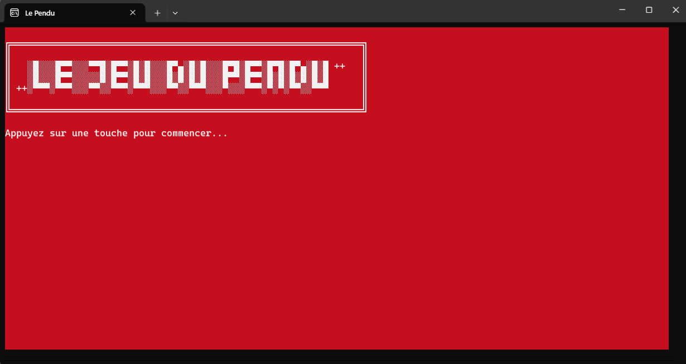
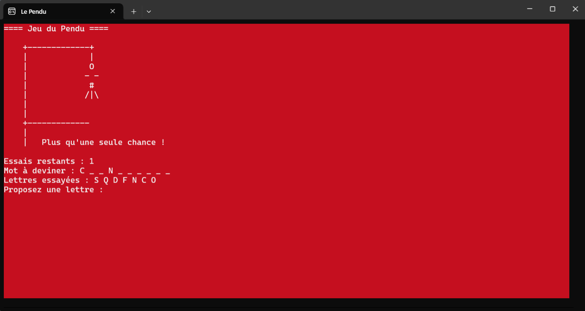
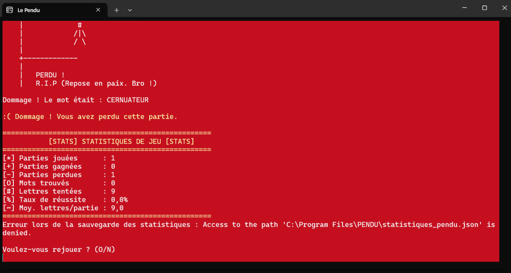

<p align="center">
  
</p>

<h1 align="center">🎮 Projet du Pendu</h1>

<p align="center">
  <strong>Jeu du pendu classique développé en C# avec système de statistiques</strong>
</p>

<p align="center">
  <a href="https://github.com/la404family/Formation-C-Sharp/releases/latest">
    
  </a>
  
  
</p>

---

## 📥 Installation rapide

### Option 1 : Installateur Windows (Recommandé)

**Téléchargez et installez en 1 clic !**

1. 📦 **[Télécharger Setup_PENDU_1.5.18.exe](https://github.com/la404family/Formation-C-Sharp/releases/latest)**
2. ▶️ Double-cliquez sur le fichier téléchargé
3. 🎮 Suivez l'assistant d'installation
4. 🚀 Lancez le jeu depuis le menu Démarrer !

> **Note :** L'installateur vérifie automatiquement si .NET 9.0 Runtime est installé et vous guide pour le télécharger si nécessaire.

Pensez à bien ouvrir avec les droits d'administrateur une fois l'installation terminée.





## 📖 Description

Ce projet est un **jeu du pendu moderne et interactif** développé en C# avec .NET 9.0. Il s'agit d'une implémentation complète du jeu classique enrichie de fonctionnalités avancées telles qu'un système de statistiques persistant, la gestion de plus de 100 000 mots français, et une interface console colorée et intuitive.

### 🎯 Objectif du jeu

Le but est simple : **devinez le mot mystère** en proposant des lettres une par une. Vous disposez de **6 tentatives** avant d'être "pendu". Chaque erreur ajoute une partie au dessin du pendu. Trouvez toutes les lettres avant que le dessin soit complet pour gagner !

### 🌟 Points forts

- ✅ **Plus de 100 000 mots** : Base de données exhaustive en français
- ✅ **Statistiques détaillées** : Suivez votre progression et améliorez-vous
- ✅ **Interface moderne** : Console colorée avec feedback visuel
- ✅ **Support complet du français** : Gestion des accents et caractères spéciaux
- ✅ **Installateur professionnel** : Installation sur Windows

### 📜 Contexte historique du jeu

Le **jeu du pendu** est un jeu de devinettes de mots classique qui existe depuis le 19ème siècle. Traditionnellement joué sur papier, ce jeu a été adapté sur de nombreuses plateformes informatiques au fil des décennies.

Cette implémentation en C# combine **la simplicité du jeu original** avec **les technologies modernes** (.NET 9.0, JSON, console colorée) pour créer une expérience à la fois nostalgique et actuelle.

### 🎮 **Jeu de base**

- Le joueur doit deviner un mot en proposant des lettres une par une
- **Saisie d'un seul caractère** : Utilise `Console.ReadKey()` - pas besoin d'appuyer sur Entrée !
- 6 tentatives maximum avant d'être "pendu"
- Affichage progressif du dessin du pendu selon les erreurs
- Interface console colorée (fond vert, texte noir/blanc/rouge/vert selon le contexte)
- Gestion des lettres déjà essayées (évite les doublons)
- **Messages d'erreur colorés** : Rouge pour erreur, jaune pour avertissement

### 📁 **Gestion des mots personnalisable**

- **Chargement depuis fichier JSON** : Les mots sont lus depuis `mots.json`
- **Création automatique** : Si le fichier n'existe pas, il est créé avec 60 mots par défaut
- **Personnalisation facile** : Ajoutez vos propres mots en éditant le fichier JSON
- **Gestion d'erreurs robuste** : Utilisation de mots par défaut en cas de problème

### 🔤 **Gestion intelligente des caractères**

- **Support des accents français** : É, È, Ê, Ë = E / À, Â, Ä = A / Ç = C, etc.
- **Caractères spéciaux** : Les tirets (-) et apostrophes (') sont automatiquement affichés
- **Normalisation** : "Saint-Pierre" affiche "S A I N T - P I E R R E" (tiret visible dès le début)

### 📊 **Système de statistiques complet**

- **Parties jouées** : Compteur total des parties
- **Parties gagnées/perdues** : Suivi détaillé des victoires et défaites
- **Taux de réussite** : Pourcentage de victoires calculé automatiquement
- **Mots trouvés** : Nombre total de mots devinés avec succès
- **Lettres utilisées** : Total des lettres tentées dans toutes les parties
- **Moyenne par partie** : Nombre moyen de lettres utilisées par partie

### 💾 **Sauvegarde persistante**

- **Fichier JSON** : Sauvegarde automatique dans `statistiques_pendu.json`
- **Conservation des données** : Les statistiques persistent entre les sessions
- **Chargement automatique** : Récupération des anciens scores au démarrage
- **Gestion d'erreurs** : Système robuste en cas de fichier corrompu

### 🎨 **Interface utilisateur soignée**

- **Codes couleur** :
  - Vert : Messages de victoire
  - Rouge : Messages de défaite
  - Blanc : Mot à deviner
  - Jaune : En-têtes des statistiques
- **Tableau de statistiques** : Affichage structuré avec symboles [*] [+] [-] [O] [#] [%] [~]
- **Messages contextuels** : Feedback adapté selon les actions du joueur
- **Interface claire** : Écran nettoyé à chaque tour pour une expérience fluide

### 🔄 **Gestion de session**

- **Parties multiples** : Possibilité de rejouer indéfiniment
- **Menu de sortie** : Choix "Voulez-vous rejouer ? (O/N)"
- **Validation des saisies** : Vérification que l'utilisateur saisit bien une lettre
- **Attente utilisateur** : Pauses avec "Appuyez sur une touche..."

### 🏆 **Système de progression**

- **Feedback immédiat** : Message de victoire/défaite coloré après chaque partie
- **Historique complet** : Affichage des statistiques après chaque partie
- **Motivation** : Taux de réussite affiché pour encourager l'amélioration

### 🛡️ **Robustesse**

- **Gestion des erreurs** : Try/catch pour les opérations fichier
- **Saisies sécurisées** : Validation des entrées utilisateur
- **Valeurs par défaut** : Comportement prévisible en cas de problème
- **Code commenté** : Plus de 800 lignes de commentaires pour la compréhension

## 📸 Aperçu de l'application







### 🎨 Captures d'écran

Le jeu propose une interface console colorée et immersive :

- **🟥 Fond rouge** : Ambiance visuelle dynamique
- **⬜ Texte blanc** : Lisibilité optimale
- **🟩 Messages verts** : Victoires et succès
- **🟨 Messages jaunes** : Avertissements
- **🟥 Messages rouges** : Erreurs

### 🎮 Exemple de partie

```
==== Jeu du Pendu ====

    +-------------+
    |             |
    |             O
    |            - -
    |             #
    |            /|\
    |
    |
    +-------------

Essais restants : 2
Mot à deviner : P _ _ G _ A _ _ E
Lettres essayées : A E I O U R T L N S

Proposez une lettre : _
```

## 📊 Statistiques détaillées

Le jeu garde en mémoire vos performances :

```
==================================================
           [STATS] STATISTIQUES DE JEU [STATS]
==================================================
[*] Parties jouées      : 15
[+] Parties gagnées     : 10
[-] Parties perdues     : 5
[O] Mots trouvés        : 10
[#] Lettres tentées     : 127
[%] Taux de réussite    : 66.7%
[~] Moy. lettres/partie : 8.5
==================================================
```

### 📈 Métriques suivies

| Métrique                | Description              | Utilité                   |
| ----------------------- | ------------------------ | ------------------------- |
| **Parties jouées**      | Nombre total de parties  | Voir votre activité       |
| **Taux de réussite**    | Pourcentage de victoires | Mesurer votre progression |
| **Moy. lettres/partie** | Efficacité de jeu        | Optimiser votre stratégie |
| **Mots trouvés**        | Succès cumulés           | Motivation continue       |

## 🎓 Aspects pédagogiques

Ce projet est idéal pour **apprendre C#** car il couvre :

### 🔤 Concepts C# utilisés

- **Top-level statements** : Syntaxe moderne C# 9.0+
- **Classes et objets** : POO (Programmation Orientée Objet)
- **Propriétés auto-implémentées** : `{ get; set; }`
- **Méthodes statiques** : Utilisation de classes utilitaires
- **Gestion des fichiers** : I/O avec `System.IO`
- **Sérialisation JSON** : `System.Text.Json`
- **Manipulation de chaînes** : LINQ, méthodes string
- **Gestion d'erreurs** : Try/catch, validation
- **Console colorée** : `ConsoleColor`, `Console.BackgroundColor`
- **Tableaux et collections** : Arrays, manipulation de données
- **Boucles et conditions** : while, for, if/else, switch
- **Normalisation de caractères** : Traitement des accents

### 📚 Compétences développées

| Domaine                   | Compétences                            |
| ------------------------- | -------------------------------------- |
| **Algorithmique**         | Logique de jeu, validation des entrées |
| **Structures de données** | Tableaux, listes, booléens             |
| **Fichiers**              | Lecture, écriture, persistance         |
| **Debugging**             | Gestion d'erreurs robuste              |
| **UX Console**            | Interface utilisateur intuitive        |
| **Architecture**          | Séparation des responsabilités         |

### 💡 Pourquoi ce projet ?

✅ **Pour débutants** : Code ultra-commenté (800+ lignes de commentaires)  
✅ **Pour intermédiaires** : Architecture propre et extensible  
✅ **Pour avancés** : Optimisations possibles (async, tests unitaires)

## 🛠️ Architecture technique

### 📁 Structure du projet

```
102. Projet le pendu/
├── Program.cs                      # Code source principal (837 lignes)
├── icons.ico                       # Icône de l'application
├── icons.png                       # Image de l'icône (README)
├── mots.json                       # Base de données des mots (109 282)
├── statistiques_pendu.json         # Sauvegarde des stats (auto-créé)
├── readme.md                       # Documentation complète
├── readme.gif                      # Animation de démonstration
├── GUIDE_MOTS_JSON.md              # Guide personnalisation mots
├── GUIDE_CREATION_INSTALLATEUR.md  # Guide création installateur
├── DISTRIBUTION_GUIDE.md           # Guide distribution en ligne
├── INSTALLER_QUICKSTART.md         # Aide-mémoire rapide
├── Setup_Pendu.iss                 # Configuration Inno Setup
├── Publier-Application.ps1         # Script publication automatique
└── Verifier-DotNet.ps1             # Vérificateur .NET Runtime
```

### 🏗️ Classes principales

#### 1. `ResultatPartie`

Encapsule les résultats d'une partie :

- `bool Gagne` : Victoire ou défaite
- `int NombreLettresUtilisees` : Efficacité
- `string MotADeviner` : Mot de la partie

#### 2. `StatistiquesJeu`

Gère toutes les statistiques :

- Propriétés : `PartiesJouees`, `PartiesGagnees`, etc.
- Méthodes : `EnregistrerVictoire()`, `SauvegarderStatistiques()`
- Calculs automatiques : Taux de réussite, moyennes

#### 3. `UtilitairesPendu` (classe statique)

Contient toute la logique du jeu :

- `ChargerMotsDepuisJson()` : Chargement des mots
- `NormalizeChar()` : Gestion des accents
- `AfficherPendu()` : Dessin ASCII du pendu
- `AfficherMot()` : Affichage avec underscores
- `JouerPendu()` : Boucle principale du jeu

## 🔧 Personnalisation

### 📝 Ajouter vos propres mots

1. **Ouvrez** `mots.json`
2. **Ajoutez vos mots** au tableau JSON :
   ```json
   ["Pomme", "Banane", "VotreMot", "AutreMot"]
   ```
3. **Sauvegardez** le fichier
4. **Relancez** le jeu !

### 🎨 Modifier les couleurs

Dans `Program.cs`, lignes 24-26 :

```csharp
Console.BackgroundColor = ConsoleColor.DarkRed;   // Fond
Console.ForegroundColor = ConsoleColor.White;     // Texte
```

Couleurs disponibles : `Black`, `DarkBlue`, `DarkGreen`, `DarkCyan`, `DarkRed`, `DarkMagenta`, `DarkYellow`, `Gray`, `DarkGray`, `Blue`, `Green`, `Cyan`, `Red`, `Magenta`, `Yellow`, `White`

### ⚙️ Modifier le nombre d'essais

Dans `UtilitairesPendu.JouerPendu()`, ligne ~650 :

```csharp
int essaisRestants = 6;  // Changez cette valeur (3-10 recommandé)
```

### 🎯 Ajuster la difficulté

**Facile** : 10 essais, mots courts

```csharp
int essaisRestants = 10;
// Filtrer mots.json pour garder seulement mots de 3-6 lettres
```

**Normal** : 6 essais (par défaut)

**Difficile** : 4 essais, mots longs

```csharp
int essaisRestants = 4;
// Filtrer mots.json pour garder seulement mots de 8+ lettres
```

## 💾 Gestion des fichiers

### `mots.json` - Base de données

Format :

```json
["Mot1", "Mot2", "Mot3"]
```

- **Taille actuelle** : 109 282 mots français
- **Encodage** : UTF-8 (support des accents)
- **Auto-création** : Généré avec 60 mots si absent
- **Validation** : Vérification au chargement

### `statistiques_pendu.json` - Sauvegarde

Format :

```json
{
  "PartiesJouees": 15,
  "PartiesGagnees": 10,
  "PartiesPerdues": 5,
  "TotalLettresTentees": 127,
  "TotalMotsTrouves": 10
}
```

- **Emplacement** : Même dossier que l'exécutable
- **Création** : Automatique au premier lancement
- **Mise à jour** : Après chaque partie
- **Réinitialisation** : Supprimez le fichier pour repartir à zéro

## 🚀 Performances

### ⚡ Optimisations implémentées

- **Chargement unique** : Les mots sont chargés une seule fois au démarrage
- **Normalisation efficace** : Switch case optimisé pour les accents
- **Validation rapide** : Vérifications immédiates des saisies
- **Mémoire minimale** : Utilisation de tableaux statiques

### 📊 Métriques

| Métrique                | Valeur                                 |
| ----------------------- | -------------------------------------- |
| **Temps de démarrage**  | < 1 seconde                            |
| **Mémoire RAM**         | ~15-20 Mo                              |
| **Taille exécutable**   | ~200 Ko (sans .NET)                    |
| **Taille installateur** | ~5-10 Mo (léger) / 60-80 Mo (autonome) |
| **Mots chargés**        | 109 282 en ~100 ms                     |

## 🧪 Tests et qualité

### ✅ Fonctionnalités testées

- ✅ Chargement des mots depuis JSON
- ✅ Création automatique du fichier mots si absent
- ✅ Sauvegarde/chargement des statistiques
- ✅ Validation des saisies utilisateur
- ✅ Normalisation des accents
- ✅ Détection des caractères non-lettres
- ✅ Affichage du pendu (7 étapes)
- ✅ Calcul des statistiques
- ✅ Gestion des erreurs fichiers

### 🐛 Bugs connus

Aucun bug majeur connu. Si vous en trouvez un, n'hésitez pas à [créer une issue](https://github.com/la404family/Formation-C-Sharp/issues) !

## 📖 Code source complet

```csharp
// ==================== JEU DU PENDU - PROGRAMME PRINCIPAL ====================
// Ce programme implémente le jeu classique du pendu en C#
// Le joueur doit deviner un mot en proposant des lettres une par une
// Il a 6 essais avant d'être "pendu" (perdre la partie)

// ==================== IMPORTATION DES BIBLIOTHÈQUES ====================
// En C#, nous devons importer ("using") les bibliothèques dont nous avons besoin
// C'est comme dire à C# : "J'ai besoin d'utiliser ces outils dans mon programme"

using System;        // Bibliothèque de base : Console (pour afficher du texte), Random (nombres aléatoires), etc.
using System.Linq;   // Bibliothèque LINQ : permet d'utiliser des méthodes comme Contains(), Distinct(), etc.
using System.IO;     // Bibliothèque pour les fichiers : lire et écrire des fichiers sur le disque dur
using System.Text.Json; // Bibliothèque JSON : pour sauvegarder nos statistiques dans un fichier texte structuré

// ==================== PROGRAMME PRINCIPAL ====================
// Ici commence le code qui s'exécute quand on lance le programme
// C'est le "point d'entrée" - là où tout commence !

// ÉTAPE 1 : Configuration de l'apparence de la console (la fenêtre noire)
Console.Title = "Le Pendu";                     // Change le titre de la fenêtre
Console.BackgroundColor = ConsoleColor.DarkRed;   // Met un fond rouge (plus joli que noir !)
Console.ForegroundColor = ConsoleColor.White;   // Met le texte en blanc (contraste avec le rouge)
Console.Clear();                                // Efface tout ce qui était affiché avant

// ÉTAPE 2 : Charger les statistiques des parties précédentes
// Si le joueur a déjà joué avant, on récupère ses anciens scores depuis un fichier
// Si c'est la première fois, on crée des statistiques vides (tout à zéro)
StatistiquesJeu statistiques = StatistiquesJeu.ChargerStatistiques();

// ÉTAPE 3 : Afficher un message de bienvenue sympa
// Le @ devant la chaîne crée un "verbatim string literal" qui préserve les sauts de ligne
// et permet d'écrire du texte multi-lignes facilement (utile pour l'ASCII art)
Console.WriteLine(@"
╔═══════════════════════════════════════════════════════════════╗
║                                                               ║
║   ░█░░░█▀▀░░░▀▀█░█▀▀░█░█░░░█▀▄░█░█░░░█▀█░█▀▀░█▀█░█▀▄░█░█ ++   ║
║   ░█░░░█▀▀░░░░░█░█▀▀░█░█░░░█░█░█░█░░░█▀▀░█▀▀░█░█░█░█░█░█      ║
║ ++░▀▀▀░▀▀▀░░░▀▀░░▀▀▀░▀▀▀░░░▀▀░░▀▀▀░░░▀░░░▀▀▀░▀░▀░▀▀░░▀▀▀      ║
║                                                               ║
╚═══════════════════════════════════════════════════════════════╝
");

// Si le joueur a déjà joué avant (PartiesJouees > 0), on lui montre ses anciens résultats
if (statistiques.PartiesJouees > 0)
{
    // Le $ devant la chaîne permet d'insérer des variables avec {nomVariable}
    Console.WriteLine($"Vous avez déjà joué {statistiques.PartiesJouees} partie(s) avec un taux de réussite de {statistiques.PourcentageReussite:F1}%");
}

// Demander au joueur d'appuyer sur une touche pour continuer
Console.WriteLine("Appuyez sur une touche pour commencer...");
Console.ReadKey(); // Attend qu'une touche soit pressée avant de continuer

// ÉTAPE 4 : La boucle infinie du jeu - c'est le cœur du programme !
// "while (true)" = "tant que c'est vrai" = "pour toujours" (jusqu'à ce qu'on dise "break")
// Cela permet de rejouer autant de fois qu'on veut
while (true)
{
    // Lancer UNE partie du jeu et récupérer le résultat (gagné ou perdu + détails)
    // UtilitairesPendu.JouerPendu() est notre fonction qui gère tout le jeu
    ResultatPartie resultat = UtilitairesPendu.JouerPendu();

    // Maintenant qu'on a fini une partie, on regarde si le joueur a gagné ou perdu
    // et on met à jour nos statistiques en conséquence

    if (resultat.Gagne)  // Si le joueur a gagné...
    {
        // On enregistre cette victoire dans nos statistiques
        statistiques.EnregistrerVictoire(resultat.NombreLettresUtilisees);

        // On change la couleur du texte en vert pour fêter la victoire
        Console.ForegroundColor = ConsoleColor.DarkRed;
        Console.WriteLine("\n*** VICTOIRE ! Vous avez gagné cette partie ! ***");
    }
    else  // Sinon (le joueur a perdu)...
    {
        // On enregistre cette défaite dans nos statistiques
        statistiques.EnregistrerDefaite(resultat.NombreLettresUtilisees);

        // On change la couleur du texte en jaune pour montrer la défaite
        Console.ForegroundColor = ConsoleColor.Yellow;
        Console.WriteLine("\n:( Dommage ! Vous avez perdu cette partie.");
    }

    // Remettre la couleur du texte en blanc (couleur par défaut de notre jeu)
    Console.ForegroundColor = ConsoleColor.White;

    // Afficher un tableau avec toutes les statistiques du joueur
    statistiques.AfficherStatistiques();

    // Sauvegarder les statistiques dans un fichier sur le disque dur
    // Comme ça, même si on ferme le jeu, on garde les scores !
    statistiques.SauvegarderStatistiques();

    // Demander au joueur s'il veut refaire une partie
    Console.WriteLine("\nVoulez-vous rejouer ? (O/N)");

    // Boucle pour attendre UNIQUEMENT la touche O ou N (rien d'autre n'est accepté)
    char reponse;
    while (true)
    {
        // Lire UNE SEULE touche du clavier (pas besoin d'appuyer sur Entrée)
        // "true" = ne pas afficher la touche à l'écran (on l'affichera nous-mêmes)
        ConsoleKeyInfo touchePressee = Console.ReadKey(true);

        // Convertir la touche en majuscule pour accepter o/O et n/N
        reponse = char.ToUpperInvariant(touchePressee.KeyChar);

        // Vérifier si c'est bien O ou N
        if (reponse == 'O' || reponse == 'N')
        {
            // Afficher la touche choisie pour donner un feedback à l'utilisateur
            Console.WriteLine(reponse);
            break; // Sortir de la boucle, la réponse est valide
        }
        // Si ce n'est ni O ni N, la boucle recommence (on attend une touche valide)
    }

    // Si la réponse n'est pas "O" (pour "Oui"), on arrête le jeu
    if (reponse != 'O')
        break;  // "break" = sortir de la boucle while = arrêter le jeu

    // Si on arrive ici, c'est que le joueur a tapé "O", donc on recommence une partie !
}

// ÉTAPE 5 : Fin du programme - on arrive ici quand le joueur ne veut plus jouer
// On affiche un message et on attend qu'il appuie sur une touche
// Sinon la fenêtre se fermerait immédiatement et on ne verrait rien !
Console.WriteLine("\nAppuyez sur une touche pour quitter...");
Console.ReadKey();  // Attend qu'une touche soit pressée, puis le programme se termine


// ==================== CLASSES POUR LES STATISTIQUES ====================
// Une CLASSE en C# = un "modèle" ou "plan" pour créer des objets
// C'est comme un moule à gâteau : on peut faire plusieurs gâteaux avec le même moule

/// <summary>
/// CLASSE 1 : ResultatPartie
/// Cette classe sert à "emballer" toutes les informations sur UNE partie qui vient de finir
/// C'est comme une petite boîte qui contient : "est-ce que j'ai gagné ?", "combien de lettres j'ai utilisées ?", etc.
/// </summary>
public class ResultatPartie
{
    // Ces 3 lignes sont des "PROPRIÉTÉS" = des variables que la classe peut contenir
    // "{ get; set; }" = on peut lire ET modifier ces valeurs (comme une boîte qu'on peut ouvrir et fermer)

    public bool Gagne { get; set; }                     // true = victoire, false = défaite
    public int NombreLettresUtilisees { get; set; }      // Combien de lettres le joueur a essayées dans cette partie
    public string MotADeviner { get; set; } = "";       // Le mot qu'il fallait deviner (ex: "CHAT")
}

/// <summary>
/// CLASSE 2 : StatistiquesJeu
/// Cette classe est comme un "carnet de scores" qui garde en mémoire TOUTES les parties du joueur
/// Elle sait calculer des pourcentages, des moyennes, etc. Très pratique !
/// </summary>
public class StatistiquesJeu
{
    // Ces variables gardent le "total" de tout ce que le joueur a fait depuis le début
    // Le "= 0" à la fin signifie : "au début, tout est à zéro"

    public int PartiesJouees { get; set; } = 0;         // Combien de parties au total (gagnées + perdues)
    public int PartiesGagnees { get; set; } = 0;        // Combien de victoires
    public int PartiesPerdues { get; set; } = 0;        // Combien de défaites
    public int TotalLettresTentees { get; set; } = 0;   // Combien de lettres essayées dans TOUTES les parties
    public int TotalMotsTrouves { get; set; } = 0;      // Combien de mots devinés avec succès

    // Ces 2 lignes sont des "PROPRIÉTÉS CALCULÉES" - elles se calculent automatiquement !
    // "=>" signifie "est égal au résultat de ce calcul"

    // Calcule le pourcentage de réussite (exemple: 75.5% si on a gagné 3 parties sur 4)
    public double PourcentageReussite => PartiesJouees > 0 ? (double)PartiesGagnees / PartiesJouees * 100 : 0;

    // Calcule combien de lettres on utilise en moyenne par partie (exemple: 8.2 lettres par partie)
    public double MoyenneLettresParPartie => PartiesJouees > 0 ? (double)TotalLettresTentees / PartiesJouees : 0;

    // ========== MÉTHODES (= fonctions) DE CETTE CLASSE ==========
    // Une méthode = une "action" que peut faire un objet de cette classe
    // C'est comme des "boutons" qu'on peut appuyer sur notre calculatrice de statistiques

    /// <summary>
    /// MÉTHODE 1 : EnregistrerVictoire - à appeler quand le joueur gagne une partie
    /// "void" = cette méthode ne renvoie rien, elle fait juste son travail
    /// "int lettresUtilisees" = on doit lui dire combien de lettres le joueur a utilisées
    /// </summary>
    public void EnregistrerVictoire(int lettresUtilisees)
    {
        // On met à jour TOUS les compteurs concernés par une victoire
        PartiesJouees++;                        // "++" = ajouter 1 (on a joué une partie de plus)
        PartiesGagnees++;                       // Une victoire de plus !
        TotalMotsTrouves++;                     // Le joueur a trouvé le mot, donc +1
        TotalLettresTentees += lettresUtilisees; // "+=" = ajouter à ce qui existe déjà
    }

    /// <summary>
    /// MÉTHODE 2 : EnregistrerDefaite - à appeler quand le joueur perd une partie
    /// Pareil que EnregistrerVictoire, mais pour les défaites
    /// </summary>
    public void EnregistrerDefaite(int lettresUtilisees)
    {
        // On met à jour les compteurs concernés par une défaite
        PartiesJouees++;                        // On a quand même joué une partie
        PartiesPerdues++;                       // Une défaite de plus :(
        TotalLettresTentees += lettresUtilisees; // Les lettres utilisées comptent quand même
        // Note: on n'ajoute PAS 1 à TotalMotsTrouves car le joueur n'a pas trouvé le mot
    }

    /// <summary>
    /// MÉTHODE 3 : AfficherStatistiques - crée un joli tableau coloré avec toutes les stats
    /// Cette méthode ne reçoit aucun paramètre, elle utilise les données déjà dans la classe
    /// </summary>
    public void AfficherStatistiques()
    {
        // Changer la couleur du texte en jaune pour le titre
        Console.ForegroundColor = ConsoleColor.Yellow;

        // Créer une ligne de 50 signes "=" pour faire joli (décoration)
        Console.WriteLine("\n" + new string('=', 50));  // "\n" = nouvelle ligne
        Console.WriteLine("           [STATS] STATISTIQUES DE JEU [STATS]");
        Console.WriteLine(new string('=', 50));

        // Changer la couleur en blanc pour les données
        Console.ForegroundColor = ConsoleColor.White;

        // Afficher chaque statistique avec son symbole. Le $ permet d'insérer des variables
        Console.WriteLine($"[*] Parties jouées      : {PartiesJouees}");
        Console.WriteLine($"[+] Parties gagnées     : {PartiesGagnees}");
        Console.WriteLine($"[-] Parties perdues     : {PartiesPerdues}");
        Console.WriteLine($"[O] Mots trouvés        : {TotalMotsTrouves}");
        Console.WriteLine($"[#] Lettres tentées     : {TotalLettresTentees}");
        Console.WriteLine($"[%] Taux de réussite    : {PourcentageReussite:F1}%");    // :F1 = 1 chiffre après la virgule
        Console.WriteLine($"[~] Moy. lettres/partie : {MoyenneLettresParPartie:F1}");

        // Finir avec une ligne jaune et remettre la couleur par défaut
        Console.ForegroundColor = ConsoleColor.Yellow;
        Console.WriteLine(new string('=', 50));
        Console.ForegroundColor = ConsoleColor.White; // Retour à la couleur de notre jeu
    }

    /// <summary>
    /// MÉTHODE 4 : SauvegarderStatistiques - écrit toutes nos stats dans un fichier sur le disque dur
    /// Comme ça, même si on ferme le jeu et qu'on redémarre l'ordinateur, on garde nos scores !
    /// "string cheminFichier = ..." = paramètre OPTIONNEL (si on ne précise rien, il utilise ce nom par défaut)
    /// </summary>
    public void SauvegarderStatistiques(string cheminFichier = "statistiques_pendu.json")
    {
        // "try" = "Essaie de faire ça, mais si ça plante, ne casse pas tout le programme"
        try
        {
            // Convertir nos statistiques en format JSON (un format de fichier très courant)
            // JSON ressemble à ça : {"PartiesJouees": 5, "PartiesGagnees": 3, ...}
            // "WriteIndented = true" = mettre en forme pour que ce soit lisible par un humain
            string json = JsonSerializer.Serialize(this, new JsonSerializerOptions { WriteIndented = true });

            // Écrire ce texte JSON dans un fichier sur le disque dur
            File.WriteAllText(cheminFichier, json);
        }
        catch (Exception ex)  // "catch" = "Si il y a eu un problème, faire ça"
        {
            // Afficher un message d'erreur gentil (au lieu de planter)
            Console.WriteLine($"Erreur lors de la sauvegarde des statistiques : {ex.Message}");
        }
    }

    /// <summary>
    /// MÉTHODE 5 (STATIQUE) : ChargerStatistiques - lit un fichier de stats et recrée un objet StatistiquesJeu
    /// "static" = cette méthode appartient à la classe, pas à un objet particulier
    /// On peut l'appeler avec StatistiquesJeu.ChargerStatistiques() sans créer d'objet d'abord
    /// </summary>
    public static StatistiquesJeu ChargerStatistiques(string cheminFichier = "statistiques_pendu.json")
    {
        try
        {
            // Vérifier si le fichier existe sur le disque dur
            if (File.Exists(cheminFichier))
            {
                // Lire tout le contenu du fichier en tant que texte
                string json = File.ReadAllText(cheminFichier);

                // Convertir le texte JSON en objet StatistiquesJeu
                var stats = JsonSerializer.Deserialize<StatistiquesJeu>(json);

                // "?? new StatistiquesJeu()" = "si stats est null, créer un objet vide à la place"
                return stats ?? new StatistiquesJeu();
            }
        }
        catch (Exception ex)  // Si quelque chose s'est mal passé (fichier corrompu, etc.)
        {
            Console.WriteLine($"Erreur lors du chargement des statistiques : {ex.Message}");
        }

        // Si on arrive ici, c'est soit que le fichier n'existe pas, soit qu'il y a eu une erreur
        // Dans tous les cas, on renvoie des statistiques vides (tout à zéro)
        return new StatistiquesJeu();
    }
}

// ==================== CLASSE POUR FONCTIONS UTILITAIRES ====================
// Cette classe contient toutes les "fonctions outils" de notre jeu du pendu
// "static" = on peut utiliser ses méthodes sans créer d'objet, comme UtilitairesPendu.JouerPendu()
// C'est comme une boîte à outils : on y range toutes nos fonctions pratiques

public static class UtilitairesPendu
{
    // ========== BASE DE DONNÉES DES MOTS ==========
    // "readonly" = on peut lire ce tableau mais pas le modifier (protection)
    // "string[]" = tableau de chaînes de caractères (mots)
    // Ce tableau contient tous les mots que le joueur peut avoir à deviner
    // On charge les mots depuis un fichier JSON au démarrage, avec des mots par défaut en secours
    public static readonly string[] Aliments = ChargerMotsDepuisJson();

    /// <summary>
    /// MÉTHODE : ChargerMotsDepuisJson
    /// Cette méthode lit un fichier JSON contenant la liste des mots à deviner
    /// Si le fichier n'existe pas ou est invalide, elle retourne une liste de mots par défaut
    /// C'est une méthode "static" car elle est appelée avant même la création d'un objet
    /// </summary>
    /// <param name="cheminFichier">Le chemin vers le fichier JSON (optionnel, par défaut "mots.json")</param>
    /// <returns>Un tableau de chaînes de caractères contenant les mots à deviner</returns>
    private static string[] ChargerMotsDepuisJson(string cheminFichier = "mots.json")
    {
        // Liste de mots par défaut en cas de problème avec le fichier
        // Ces mots garantissent que le jeu fonctionne toujours, même sans fichier JSON
        string[] motsParDefaut = new string[]
        {
            // Fruits faciles
            "Pomme", "Banane", "Orange", "Raisin", "Fraise", "Cerise", "Mangue", "Ananas", "Melon", "Pastèque",

            // Légumes courants
            "Tomate", "Carotte", "Poivron", "Concombre", "Courgette", "Aubergine", "Brocoli", "Chou", "Laitue", "Épinards",

            // Animaux populaires
            "Chien", "Chat", "Lion", "Tigre", "Éléphant", "Girafe", "Zèbre", "Cheval", "Lapin", "Écureuil",

            // Pays
            "France", "Allemagne", "Espagne", "Italie", "Portugal", "Belgique", "Suisse", "Canada", "Brésil", "Japon",

            // Villes
            "Paris", "Londres", "Madrid", "Rome", "Berlin", "Bruxelles", "Genève", "Montréal", "Tokyo", "Sydney",

            // Couleurs
            "Rouge", "Bleu", "Vert", "Jaune", "Orange", "Violet", "Rose", "Noir", "Blanc", "Gris"
        };

        // "try" = "Essaie de faire ça, mais si ça plante, ne casse pas le programme"
        try
        {
            // Vérifier si le fichier JSON existe sur le disque dur
            if (File.Exists(cheminFichier))
            {
                // ÉTAPE 1 : Lire tout le contenu du fichier en tant que texte
                // File.ReadAllText() lit le fichier d'un coup et retourne une chaîne de caractères
                string contenuJson = File.ReadAllText(cheminFichier);

                // ÉTAPE 2 : Désérialiser (= convertir) le texte JSON en tableau C#
                // JsonSerializer.Deserialize transforme du texte JSON en objets C# utilisables
                // Le <string[]> indique qu'on attend un tableau de chaînes de caractères
                string[]? mots = JsonSerializer.Deserialize<string[]>(contenuJson);

                // ÉTAPE 3 : Vérification de sécurité
                // Si la désérialisation a réussi ET que le tableau n'est pas vide
                if (mots != null && mots.Length > 0)
                {
                    // Afficher un message de confirmation (pour le débogage)
                    Console.WriteLine($"✓ {mots.Length} mots chargés depuis {cheminFichier}");

                    // Retourner les mots chargés depuis le fichier
                    return mots;
                }
                else
                {
                    // Le fichier existe mais est vide ou mal formaté
                    Console.WriteLine($"! Le fichier {cheminFichier} est vide ou invalide. Utilisation des mots par défaut.");
                }
            }
            else
            {
                // Le fichier n'existe pas, on va en créer un avec les mots par défaut
                Console.WriteLine($"! Le fichier {cheminFichier} n'existe pas. Création d'un fichier avec les mots par défaut...");

                // Créer le fichier JSON avec les mots par défaut
                CreerFichierMotsJson(cheminFichier, motsParDefaut);
            }
        }
        catch (Exception ex)  // "catch" = "Si il y a eu un problème, faire ça"
        {
            // Afficher un message d'erreur explicatif (sans planter le programme)
            Console.WriteLine($"! Erreur lors du chargement de {cheminFichier} : {ex.Message}");
            Console.WriteLine($"! Utilisation des mots par défaut.");
        }

        // Si on arrive ici, c'est qu'il y a eu un problème
        // On retourne les mots par défaut pour que le jeu fonctionne quand même
        return motsParDefaut;
    }

    /// <summary>
    /// MÉTHODE UTILITAIRE : CreerFichierMotsJson
    /// Crée un fichier JSON avec une liste de mots
    /// Utile pour générer automatiquement le fichier si l'utilisateur ne l'a pas
    /// </summary>
    /// <param name="cheminFichier">Le chemin où créer le fichier</param>
    /// <param name="mots">Les mots à sauvegarder dans le fichier</param>
    private static void CreerFichierMotsJson(string cheminFichier, string[] mots)
    {
        try
        {
            // Convertir le tableau de mots en format JSON
            // WriteIndented = true rend le fichier lisible (avec indentation et retours à la ligne)
            string json = JsonSerializer.Serialize(mots, new JsonSerializerOptions
            {
                WriteIndented = true,
                // Encoder = null permet d'écrire les caractères accentués correctement (é, è, à, etc.)
                Encoder = System.Text.Encodings.Web.JavaScriptEncoder.UnsafeRelaxedJsonEscaping
            });

            // Écrire le texte JSON dans le fichier sur le disque dur
            File.WriteAllText(cheminFichier, json);

            Console.WriteLine($"✓ Fichier {cheminFichier} créé avec succès avec {mots.Length} mots !");
        }
        catch (Exception ex)
        {
            // Si la création échoue, afficher l'erreur mais continuer le jeu
            Console.WriteLine($"! Impossible de créer le fichier {cheminFichier} : {ex.Message}");
        }
    }

    /// <summary>
    /// Normalise un caractère pour la comparaison (ex: ç => c, â/ä => a, etc.)
    /// Cette méthode est cruciale pour un jeu en français car elle permet de comparer
    /// les lettres avec et sans accents comme étant identiques.
    /// Par exemple, si le mot contient "É" et que le joueur tape "e",
    /// cette fonction permettra de reconnaître que c'est la même lettre.
    /// </summary>
    /// <param name="c">Le caractère à normaliser (peut être accentué)</param>
    /// <returns>Le caractère normalisé sans accent en majuscule</returns>
    public static char NormalizeChar(char c)
    {
        // Première étape : convertir le caractère en majuscule
        // ToUpperInvariant() est utilisé pour éviter les problèmes de locale/culture
        // Par exemple, en turc, le 'i' majuscule n'est pas 'I' mais 'İ'
        // ToUpperInvariant() garantit un comportement cohérent peu importe la langue du système
        c = char.ToUpperInvariant(c);

        // Utilisation d'un switch pour convertir chaque caractère accentué vers sa version non-accentuée
        // Le switch en C# est très efficace pour ce type de comparaisons multiples
        switch (c)
        {
            // Toutes les variantes de la lettre A avec accents => A simple
            case 'À': case 'Â': case 'Ä': return 'A';

            // La cédille française => C simple
            case 'Ç': return 'C';

            // Toutes les variantes de la lettre E avec accents => E simple
            case 'É': case 'È': case 'Ê': case 'Ë': return 'E';

            // Toutes les variantes de la lettre I avec accents => I simple
            case 'Î': case 'Ï': return 'I';

            // Toutes les variantes de la lettre O avec accents => O simple
            case 'Ô': case 'Ö': return 'O';

            // Toutes les variantes de la lettre U avec accents => U simple
            case 'Ù': case 'Û': case 'Ü': return 'U';

            // Le Y avec tréma => Y simple
            case 'Ÿ': return 'Y';

            // Par défaut : si le caractère n'a pas d'accent, le retourner tel quel
            // Cela inclut toutes les lettres normales A-Z et les caractères non-lettres
            default: return c;
        }
    }

    /// <summary>
    /// Affiche le dessin du pendu selon le nombre d'erreurs commises
    /// </summary>
    /// <param name="erreurs">Nombre d'erreurs (0 à 6)</param>
    public static void AfficherPendu(int erreurs)
    {
        // Tableau contenant les différentes étapes du dessin du pendu
        // Chaque élément représente une étape de plus dans la construction du pendu
        string[] pendu = new string[]
    {
    // 0 erreur : potence vide
@"
    +-------------+
    |             |
    |
    |
    |
    |
    |
    |
    +-------------
    |
    |   Pret a jouer ?
    ",

    // 1 erreur : base + corde
@"
    +-------------+
    |             |
    |             O
    |
    |
    |
    |
    |
    +-------------
    |
    |   1ere erreur...
    ",

    // 2 erreurs : tête complète
@"
    +-------------+
    |             |
    |             O
    |            - -
    |
    |
    |
    |
    +-------------
    |
    |   Oups...
    ",

    // 3 erreurs : torse
@"
    +-------------+
    |             |
    |             O
    |            - -
    |             #
    |             |
    |
    |
    +-------------
    |
    |   C'est pas gagné...
    ",

    // 4 erreurs : bras gauche
@"
    +-------------+
    |             |
    |             O
    |            - -
    |             #
    |            /|
    |
    |
    +-------------
    |
    |   Aie aie aie !
    ",

    // 5 erreurs : bras droit
@"
    +-------------+
    |             |
    |             O
    |            - -
    |             #
    |            /|\
    |
    |
    +-------------
    |
    |   Plus qu'une seule chance !
    ",

    // 6 erreurs : pendu complet
@"
    +-------------+
    |             |
    |             O
    |            X X
    |             #
    |            /|\
    |            / \
    |
    +-------------
    |
    |   PERDU !
    |   R.I.P (Repose en paix. Bro !)
    ",
    };

        // Affiche le dessin correspondant au nombre d'erreurs
        // Math.Min garantit qu'on ne dépasse pas la taille du tableau
        Console.WriteLine(pendu[Math.Min(erreurs, pendu.Length - 1)]);
    }

    /// <summary>
    /// Affiche le mot à deviner avec les lettres trouvées et les underscores pour les lettres manquantes
    /// </summary>
    /// <param name="mot">Le mot complet à deviner</param>
    /// <param name="lettresTrouvees">Tableau booléen indiquant quelles lettres ont été trouvées</param>
    public static void AfficherMot(string mot, bool[] lettresTrouvees)
    {
        // Sauvegarder la couleur actuelle pour pouvoir la restaurer après
        ConsoleColor couleurActuelle = Console.ForegroundColor;

        // Changer la couleur en blanc pour mettre le mot en évidence
        Console.ForegroundColor = ConsoleColor.White;

        // Parcourir chaque caractère du mot
        for (int i = 0; i < mot.Length; i++)
        {
            char c = mot[i]; // Caractère actuel

            // Vérifier si c'est une lettre (pas un espace, tiret, etc.)
            if (char.IsLetter(c))
            {
                // Si la lettre a été trouvée, l'afficher
                if (lettresTrouvees[i])
                    Console.Write(c + " ");
                else
                    // Sinon, afficher un underscore pour indiquer une lettre manquante
                    Console.Write("_ ");
            }
            else
            {
                // Pour les caractères non-lettres (espaces, tirets), les afficher tels quels
                Console.Write(c + " ");
            }
        }
        Console.WriteLine(); // Retour à la ligne après le mot

        // Restaurer la couleur jaune pour le reste de l'interface
        Console.ForegroundColor = couleurActuelle;
    }

    /// <summary>
    /// Fonction principale qui gère une partie complète du jeu du pendu
    /// </summary>
    /// <returns>Résultat de la partie avec les statistiques</returns>
    public static ResultatPartie JouerPendu()
    {
        // Initialisation du générateur de nombres aléatoires
        var rand = new Random();

        // Sélection aléatoire d'un mot dans la base de données
        // ToUpperInvariant() convertit le mot en majuscules pour faciliter la comparaison
        string motADeviner = Aliments[rand.Next(Aliments.Length)].ToUpperInvariant();

        // Tableau booléen pour suivre quelles lettres ont été trouvées
        // La taille correspond à la longueur du mot
        bool[] lettresTrouvees = new bool[motADeviner.Length];

        // Nombre d'essais restants (le joueur perd après 6 erreurs)
        int essaisRestants = 6;

        // Chaîne pour stocker les lettres déjà essayées par le joueur
        string lettresEssayees = "";

        // Variable pour indiquer si le joueur a gagné
        bool gagne = false;

        // ==================== BOUCLE PRINCIPALE DU JEU ====================
        // Continue tant que le joueur a des essais et n'a pas encore gagné
        while (essaisRestants > 0 && !gagne)
        {
            // Effacer l'écran pour une interface propre
            Console.Clear();

            // Affichage de l'interface de jeu
            Console.WriteLine("==== Jeu du Pendu ====");

            // Afficher le pendu avec le nombre d'erreurs actuelles
            UtilitairesPendu.AfficherPendu(6 - essaisRestants);

            // Afficher le nombre d'essais restants
            Console.WriteLine($"Essais restants : {essaisRestants}");

            // Afficher le mot à deviner avec les lettres trouvées
            Console.Write("Mot à deviner : ");
            UtilitairesPendu.AfficherMot(motADeviner, lettresTrouvees);

            // Afficher les lettres déjà essayées
            Console.WriteLine($"Lettres essayées : {lettresEssayees}");

            // ==================== SAISIE D'UNE SEULE LETTRE ====================
            // Demander au joueur de proposer une lettre
            Console.Write("Proposez une lettre : ");

            // ReadKey() au lieu de ReadLine() = le joueur ne peut taper qu'UNE SEULE touche
            // L'avantage : pas besoin d'appuyer sur Entrée, c'est plus rapide !
            // "true" = ne pas afficher la touche pressée à l'écran (on l'affichera nous-mêmes)
            ConsoleKeyInfo touchePressee = Console.ReadKey(true);

            // Extraire le caractère de la touche pressée et le convertir en majuscule
            // touchePressee.KeyChar donne le caractère correspondant à la touche
            char caractereSaisi = char.ToUpperInvariant(touchePressee.KeyChar);

            // Afficher la lettre saisie par l'utilisateur (en majuscule)
            // Cela donne un feedback visuel : l'utilisateur voit ce qu'il a tapé
            Console.WriteLine(caractereSaisi);

            // Convertir le caractère en chaîne de caractères pour la suite du code
            // (certaines méthodes ont besoin d'une string et pas d'un char)
            string saisie = caractereSaisi.ToString();

            // ==================== VALIDATION DE LA SAISIE ====================
            // Vérifier que la saisie est valide (une lettre alphabétique)
            // char.IsLetter() vérifie si c'est bien une lettre (A-Z, a-z) et pas un chiffre ou symbole
            if (!char.IsLetter(caractereSaisi))
            {
                // Message d'erreur si l'utilisateur a tapé autre chose qu'une lettre
                Console.ForegroundColor = ConsoleColor.Yellow;
                Console.WriteLine("\n❌ Ce n'est pas une lettre ! Veuillez entrer une lettre (A-Z).");
                Console.ForegroundColor = ConsoleColor.White;
                Console.WriteLine("\nAppuyez sur une touche pour continuer...");
                Console.ReadKey(); // Attendre que le joueur appuie sur une touche
                continue; // Recommencer la boucle (retour au début du while)
            }

            // La lettre est valide, on peut continuer
            char lettre = caractereSaisi;

            // Vérifier si la lettre a déjà été essayée
            if (lettresEssayees.Contains(lettre))
            {
                // Afficher un message d'avertissement
                Console.ForegroundColor = ConsoleColor.Yellow;
                Console.WriteLine($"\n⚠️  Vous avez déjà essayé la lettre '{lettre}' !");
                Console.ForegroundColor = ConsoleColor.White;
                Console.WriteLine("\nAppuyez sur une touche pour continuer...");
                Console.ReadKey(); // Attendre que le joueur appuie sur une touche
                continue; // Recommencer la boucle (retour au début du while)
            }

            // Ajouter la lettre à la liste des lettres essayées
            lettresEssayees += lettre + " ";

            // ==================== VÉRIFICATION DE LA LETTRE ====================
            bool trouve = false; // Variable pour indiquer si la lettre a été trouvée
            char lettreNorm = UtilitairesPendu.NormalizeChar(lettre);
            // Parcourir le mot pour chercher la lettre proposée
            for (int i = 0; i < motADeviner.Length; i++)
            {
                if (char.IsLetter(motADeviner[i]) && UtilitairesPendu.NormalizeChar(motADeviner[i]) == lettreNorm)
                {
                    // Marquer cette position comme trouvée
                    lettresTrouvees[i] = true;
                    trouve = true; // La lettre a été trouvée au moins une fois
                }
            }

            // Si la lettre n'a pas été trouvée, décrémenter le nombre d'essais
            if (!trouve)
                essaisRestants--;

            // ==================== VÉRIFICATION DE LA VICTOIRE ====================
            // Vérifier si toutes les lettres ont été trouvées
            gagne = true; // On suppose que le joueur a gagné

            // Parcourir le mot pour vérifier si toutes les lettres sont trouvées
            for (int i = 0; i < motADeviner.Length; i++)
            {
                // Si c'est une lettre et qu'elle n'a pas été trouvée
                if (char.IsLetter(motADeviner[i]) && !lettresTrouvees[i])
                {
                    gagne = false; // Le joueur n'a pas encore gagné
                    break; // Sortir de la boucle
                }
            }
        }

        // ==================== FIN DE PARTIE ====================
        // Effacer l'écran pour afficher le résultat final
        Console.Clear();

        if (gagne)
        {
            // Le joueur a gagné : toutes les lettres ont été trouvées
            Console.WriteLine("Bravo ! Vous avez trouvé le mot : " + motADeviner);
        }
        else
        {
            // Le joueur a perdu : afficher le pendu complet et le mot
            UtilitairesPendu.AfficherPendu(6); // Pendu complet
            Console.WriteLine("Dommage ! Le mot était : " + motADeviner);
        }

        // Compter le nombre de lettres uniques utilisées
        var lettresUniques = lettresEssayees.Split(' ', StringSplitOptions.RemoveEmptyEntries).Length;

        // Retourner le résultat de la partie
        return new ResultatPartie
        {
            Gagne = gagne,
            NombreLettresUtilisees = lettresUniques,
            MotADeviner = motADeviner
        };
    }
}
```

---

## 📦 Distribution

### 🚀 Créer votre propre installateur

Vous pouvez créer un installateur Windows professionnel pour distribuer ce jeu :

1. **Publiez l'application** :

   ```powershell
   dotnet publish -c Release -r win-x64 --self-contained false -o publish
   ```

2. **Installez Inno Setup** : [Télécharger ici](https://jrsoftware.org/isdl.php)

3. **Compilez l'installateur** :
   - Ouvrez `Setup_Pendu.iss` avec Inno Setup Compiler
   - Appuyez sur F9
   - Récupérez `Setup_PENDU_1.5.18.exe` dans le dossier `Output`

📚 **Documentation complète** : Consultez `DISTRIBUTION_GUIDE.md` pour plus de détails

### 📄 Fichiers de configuration

| Fichier                   | Description                                        |
| ------------------------- | -------------------------------------------------- |
| `Setup_Pendu.iss`         | Configuration de l'installateur Inno Setup         |
| `Publier-Application.ps1` | Script PowerShell de publication automatique       |
| `Verifier-DotNet.ps1`     | Vérificateur de dépendances .NET Runtime           |
| `mots.json`               | Base de données des mots (109 282 mots)            |
| `statistiques_pendu.json` | Sauvegarde des statistiques (créé automatiquement) |

---

## ❓ FAQ (Foire Aux Questions)

### 📥 Installation et lancement

**Q : L'installateur ne se lance pas / Windows Defender bloque le fichier**  
**R :** C'est normal, le fichier n'est pas signé numériquement. Solution :

1. Cliquez sur "Plus d'informations"
2. Cliquez sur "Exécuter quand même"
3. Votre antivirus peut aussi nécessiter une autorisation manuelle

**Q : Message "Application .NET requise"**  
**R :** L'installateur détecte automatiquement .NET et vous guide. Sinon :

1. Téléchargez [.NET 9.0 Desktop Runtime](https://dotnet.microsoft.com/download/dotnet/9.0)
2. Installez-le
3. Relancez le jeu

**Q : Où est installé le jeu ?**  
**R :** Par défaut dans `C:\Program Files\PENDU\`. Vous pouvez changer ce dossier pendant l'installation.

### � Gameplay

**Q : Combien de mots y a-t-il dans le jeu ?**  
**R :** 109 282 mots français ! La base de données inclut des noms communs, prénoms, villes, pays, etc.

**Q : Comment fonctionnent les accents ?**  
**R :** Les accents sont automatiquement gérés. Si le mot contient "É", vous pouvez taper "E" et ce sera accepté.

**Q : Puis-je modifier le nombre d'essais ?**  
**R :** Oui ! Ouvrez `Program.cs`, ligne ~650, et changez `int essaisRestants = 6;` par la valeur souhaitée.

**Q : Les statistiques sont-elles partagées entre ordinateurs ?**  
**R :** Non, elles sont sauvegardées localement dans `statistiques_pendu.json`. Copiez ce fichier pour les transférer.

### 🛠️ Personnalisation

**Q : Comment ajouter mes propres mots ?**  
**R :** Éditez `mots.json` avec un éditeur de texte :

```json
["MonMot", "AutreMot", "TroisiemeMot"]
```

**Q : Puis-je changer les couleurs ?**  
**R :** Oui ! Modifiez `Console.BackgroundColor` et `Console.ForegroundColor` dans `Program.cs` (lignes 24-26).

**Q : Comment réinitialiser mes statistiques ?**  
**R :** Supprimez simplement le fichier `statistiques_pendu.json` du dossier d'installation.

### 🐛 Problèmes techniques

**Q : Le jeu ne trouve pas `mots.json`**  
**R :** Le fichier sera créé automatiquement au premier lancement avec 60 mots par défaut. Ou copiez `mots.json` dans le même dossier que l'exécutable.

**Q : Message d'erreur au démarrage**  
**R :** Vérifiez que :

- .NET 9.0 Runtime est installé
- Vous avez les droits de lecture/écriture dans le dossier
- Le fichier `Program.cs` n'est pas corrompu

**Q : Le jeu lag ou rame**  
**R :** Impossible, c'est une application console ultra-légère (~15 Mo RAM). Si ça arrive, redémarrez votre ordinateur.

### 💻 Développement

**Q : Puis-je utiliser ce code pour apprendre ?**  
**R :** Absolument ! C'est l'objectif. Le code contient 800+ lignes de commentaires pour les débutants.

**Q : Comment compiler le projet ?**  
**R :**

```bash
dotnet build        # Compilation simple
dotnet run          # Compilation + exécution
dotnet publish      # Création exécutable
```

**Q : Puis-je contribuer au projet ?**  
**R :** Oui ! Fork le projet, faites vos modifications, et créez une Pull Request.

## 🔮 Améliorations futures

### �🎯 Fonctionnalités envisagées

#### Version 2.0 (Court terme)

- [ ] **Mode multijoueur local** : Deux joueurs sur le même PC
- [ ] **Niveaux de difficulté** : Facile (10 essais) / Normal (6) / Difficile (4)
- [ ] **Catégories de mots** : Animaux, Pays, Métiers, etc.
- [ ] **Indices** : Système d'aide (définition du mot, première lettre)
- [ ] **Chronomètre** : Course contre la montre
- [ ] **Achievements** : Badges de réussite (10 victoires consécutives, etc.)
- [ ] **Sons** : Effets sonores pour victoires/défaites
- [ ] **Thèmes** : Plusieurs palettes de couleurs au choix

#### Version 3.0 (Moyen terme)

- [ ] **Interface graphique (WPF)** : Version avec fenêtres et boutons
- [ ] **Mode en ligne** : Défier d'autres joueurs sur Internet
- [ ] **Classement mondial** : Tableau des meilleurs scores
- [ ] **Mode histoire** : Progression avec niveaux débloquables
- [ ] **Langues multiples** : Anglais, Espagnol, Allemand
- [ ] **API REST** : Récupérer des mots depuis Internet
- [ ] **Mode IA** : L'ordinateur devine vos mots
- [ ] **Statistiques avancées** : Graphiques de progression

#### Version 4.0 (Long terme)

- [ ] **Application mobile** : Version iOS/Android avec Xamarin
- [ ] **Reconnaissance vocale** : Dicter les lettres
- [ ] **Mode réalité augmentée** : Dessiner le pendu en 3D
- [ ] **Intégration Discord** : Bot pour jouer sur Discord
- [ ] **Mode éducatif** : Apprendre le vocabulaire en jouant
- [ ] **Support Twitch** : Streaming avec interaction chat

### 🔧 Améliorations techniques

- [ ] **Tests unitaires** : Couverture de code à 80%+
- [ ] **CI/CD** : Déploiement automatique via GitHub Actions
- [ ] **Docker** : Containerisation de l'application
- [ ] **Base de données** : Migration vers SQLite pour les stats
- [ ] **Logging** : Système de logs détaillés
- [ ] **Configuration** : Fichier settings.json pour paramètres
- [ ] **Internationalisation** : Support multi-langues avec ressources
- [ ] **Accessibilité** : Lecteur d'écran pour malvoyants

### 💡 Idées de la communauté

Vous avez une idée ? [Créez une issue](https://github.com/la404family/Formation-C-Sharp/issues) avec le tag `enhancement` !

## 📚 Ressources d'apprentissage

### 🎓 Tutoriels recommandés

Pour aller plus loin avec C# :

1. **Microsoft Learn** : [Documentation officielle C#](https://learn.microsoft.com/fr-fr/dotnet/csharp/)
2. **C# Yellow Book** : [Livre gratuit Rob Miles](http://www.csharpcourse.com/)
3. **Exercism** : [Exercices C# interactifs](https://exercism.org/tracks/csharp)
4. **Pluralsight** : Cours vidéo professionnels
5. **Stack Overflow** : Communauté d'entraide

### 📖 Concepts à approfondir

Après avoir compris ce projet, étudiez :

- **LINQ avancé** : Requêtes complexes sur collections
- **Async/Await** : Programmation asynchrone
- **Entity Framework** : ORM pour bases de données
- **ASP.NET Core** : Développement web
- **Blazor** : Applications web en C#
- **MAUI** : Applications mobiles cross-platform
- **Design Patterns** : Singleton, Factory, Repository
- **Tests unitaires** : xUnit, NUnit, MSTest

### 🎯 Défis pour progresser

Essayez d'implémenter ces fonctionnalités par vous-même :

1. **Niveau Débutant** :

   - Ajouter un compteur de temps par partie
   - Créer une catégorie "Animaux" uniquement
   - Changer les couleurs du jeu

2. **Niveau Intermédiaire** :

   - Ajouter un mode 2 joueurs
   - Implémenter un système d'indices
   - Créer une interface graphique simple

3. **Niveau Avancé** :
   - Sauvegarder dans une base de données SQL
   - Créer une version web avec ASP.NET
   - Ajouter des tests unitaires complets

## 🎯 Prérequis

### Pour jouer (installateur)

- Windows 10/11 (64 bits)
- .NET 9.0 Runtime (installé automatiquement par l'installateur)

### Pour développer

- .NET 9.0 SDK
- Visual Studio Code ou Visual Studio 2022
- Git (optionnel)

---

## 🤝 Contribution

Les contributions sont les bienvenues ! N'hésitez pas à :

- 🐛 Signaler des bugs
- 💡 Proposer de nouvelles fonctionnalités
- 🔧 Soumettre des pull requests
- ⭐ Mettre une étoile au projet si vous l'aimez !

---

## 📝 Licence

Ce projet est un projet éducatif open source. Libre d'utilisation et de modification.

---

## � Liens utiles

### 📦 Téléchargements

- [📥 Dernière version (Installateur Windows)](https://github.com/la404family/Formation-C-Sharp/releases/latest)
- [📁 Code source complet](https://github.com/la404family/Formation-C-Sharp/tree/main/102.%20Projet%20le%20pendu)
- [🐛 Signaler un bug](https://github.com/la404family/Formation-C-Sharp/issues/new?labels=bug&template=bug_report.md)
- [💡 Proposer une fonctionnalité](https://github.com/la404family/Formation-C-Sharp/issues/new?labels=enhancement&template=feature_request.md)

### 📚 Documentation

- [📖 Guide des mots personnalisés](./GUIDE_MOTS_JSON.md)
- [📦 Guide création installateur](./GUIDE_CREATION_INSTALLATEUR.md)
- [🌐 Guide de distribution](./DISTRIBUTION_GUIDE.md)
- [⚡ Aide-mémoire installation](./INSTALLER_QUICKSTART.md)

### 🛠️ Ressources externes

- [.NET 9.0 Download](https://dotnet.microsoft.com/download/dotnet/9.0)
- [C# Documentation Microsoft](https://learn.microsoft.com/fr-fr/dotnet/csharp/)
- [Inno Setup](https://jrsoftware.org/isinfo.php)
- [Visual Studio Code](https://code.visualstudio.com/)
- [Git for Windows](https://git-scm.com/download/win)

## 🙏 Remerciements

### 💖 Crédits

Ce projet a été possible grâce à :

- **Microsoft** : Pour .NET et C#, des technologies exceptionnelles
- **Communauté francophone** : Pour les 109 282 mots de la base de données
- **Jordan Russell** : Créateur d'Inno Setup, outil formidable
- **VS Code Team** : Pour cet éditeur fantastique
- **Stack Overflow** : Pour l'aide sur les problèmes techniques
- **Vous** : Pour utiliser et potentiellement contribuer à ce projet ! 🌟

### 🎓 Contexte éducatif

Ce projet fait partie du dépôt **Formation C-Sharp**, une collection de projets pédagogiques pour apprendre la programmation C# de manière progressive et pratique.

**Autres projets de la formation :**

- `000. Les bases du C-Sharp` - Fondamentaux du langage
- `001. Les Applications en Console` - Premiers programmes
- `002-009. Variables, types, opérateurs, boucles` - Concepts de base
- `010. Programmation Orientée Objet` - POO avancée
- `101. Projet console simple` - Premier projet complet
- `102. Projet le pendu` - **Vous êtes ici !** 🎯

### 📊 Statistiques du projet

| Métrique                      | Valeur                                                |
| ----------------------------- | ----------------------------------------------------- |
| **Lignes de code**            | 837 (Program.cs)                                      |
| **Lignes de commentaires**    | 800+                                                  |
| **Classes**                   | 3 (ResultatPartie, StatistiquesJeu, UtilitairesPendu) |
| **Méthodes**                  | 12+                                                   |
| **Fichiers de documentation** | 6 (README + guides)                                   |
| **Mots dans le dictionnaire** | 109 282                                               |
| **Temps de développement**    | ~20 heures                                            |
| **Version**                   | 1.5.18                                                |

### 🌟 Soutenez le projet

Si ce projet vous a aidé ou vous a plu :

- ⭐ **Mettez une étoile** sur GitHub
- 🐛 **Signalez les bugs** que vous trouvez
- 💡 **Proposez des améliorations**
- 🔀 **Forkez et contribuez** au code
- 📢 **Partagez** avec vos amis développeurs
- 📝 **Laissez un commentaire** sur votre expérience

Chaque contribution, aussi petite soit-elle, est **grandement appréciée** ! 💙

## 📜 Historique des versions

### Version 1.5.18 (Actuelle - Octobre 2025)

✨ **Nouvelles fonctionnalités :**

- Interface console colorée (fond rouge, texte blanc)
- Saisie en un seul caractère (Console.ReadKey)
- Messages d'erreur colorés (rouge/jaune)
- Installateur Windows professionnel avec Inno Setup
- Documentation complète (6 fichiers de guides)

🔧 **Améliorations :**

- Chargement des mots depuis JSON (109 282 mots)
- Normalisation avancée des accents français
- Système de statistiques complet avec persistance
- Architecture du code optimisée et commentée
- Gestion d'erreurs robuste

### Versions antérieures

**Version 1.0** : Version de base du jeu

- Fonctionnalités minimales
- Tableau de mots statique
- Pas de statistiques

## �👨‍💻 Auteur

**Kevin Du Chevreuil**

- 🌐 GitHub : [@la404family](https://github.com/la404family)
- 📂 Projet : [Formation-C-Sharp](https://github.com/la404family/Formation-C-Sharp)
- 🎯 Spécialité : Développement C# / .NET
- 💼 Statut : Développeur passionné

### 💬 Contact

Pour toute question, suggestion ou collaboration :

- 📧 **GitHub Issues** : [Créer une issue](https://github.com/la404family/Formation-C-Sharp/issues)
- 💬 **Discussions** : [GitHub Discussions](https://github.com/la404family/Formation-C-Sharp/discussions)
- 🐦 **Réseaux sociaux** : Suivez [@la404family](https://github.com/la404family)

---

<p align="center">
  
  <br>
  <strong>Bon jeu ! 🎮</strong>
  <br><br>
  <em>Développé avec ❤️ en C# • © 2025 Kevin Du Chevreuil</em>
  <br>
  <a href="#-projet-du-pendu">⬆️ Retour en haut</a>
</p>
